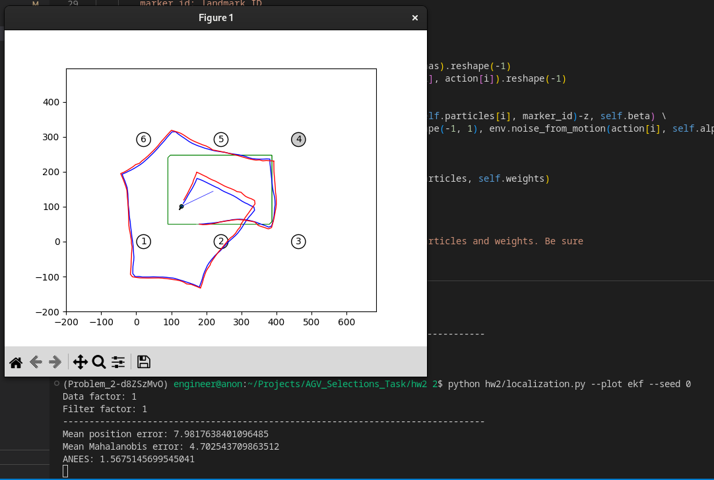
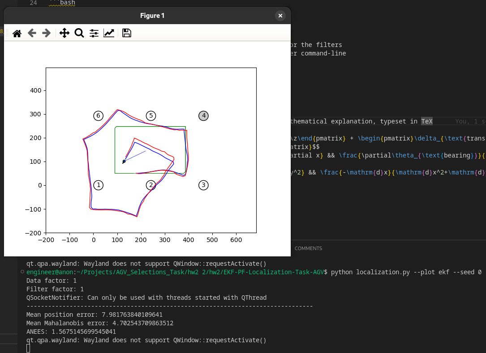

# filters

The starter code is written in Python and depends on NumPy and Matplotlib.
This README gives a brief overview of each file.

- `localization.py` -- This is your main entry point for running experiments.
- `soccer_field.py` -- This implements the dynamics and observation functions, as well as the noise models for both. Add your Jacobian implementations here!
- `utils.py` -- This contains assorted plotting functions, as well as a useful
  function for normalizing angles.
- `policies.py` -- This contains a simple policy, which you can safely ignore.
- `ekf.py` -- Add your extended Kalman filter implementation here!
- `pf.py` -- Add your particle filter implementation here!

## Command-Line Interface

To visualize the robot in the soccer field environment, run
```bash
$ python localization.py --plot none
```
The blue line traces out the robot's position, which is a result of noisy actions.
The green line traces the robot's position assuming that actions weren't noisy.

After you implement a filter, the filter's estimate of the robot's position will be drawn in red.
```bash
$ python localization.py --plot ekf
$ python localization.py --plot pf
```

You can scale the noise factors for the data generation process or the filters
with the `--data-factor` and `--filter-factor` flags. To see other command-line
flags available to you, run
```bash
$ python localization.py -h
```

## Screenshots of successful runs




## Explanation of Solution

TODO: this is incomplete, this section was intended to be the mathematical explanation, typeset in TeX

$$ \begin{pmatrix}x'\\y'\\ \theta'\end{pmatrix} = \begin{pmatrix}x\\y\\ \theta\end{pmatrix} + \begin{pmatrix}\delta_{\text{trans}}\cos(\theta+\delta_{\text{rot1}})\\
\delta_{\text{trans}}\sin(\theta+\delta_{\text{rot1}}) \\ \delta_{\text{rot2}}\end{pmatrix}$$
$$ H = \begin{pmatrix} \frac{\partial\theta_{\text{bearing}}}{\partial x} && \frac{\partial\theta_{\text{bearing}}}{\partial y} && \frac{\partial\theta_{\text{bearing}}}{\partial z}\end{pmatrix}$$
$$ = \begin{pmatrix} \frac{\mathrm{d}y}{\mathrm{d}x^2+\mathrm{d}y^2} && \frac{-\mathrm{d}x}{\mathrm{d}x^2+\mathrm{d}y^2} && -1\end{pmatrix}$$
